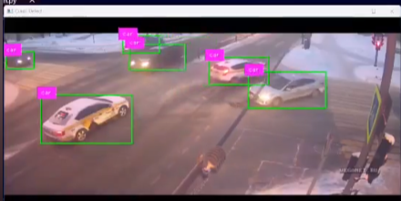
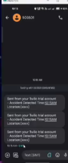

<div align="center">

# 🚨 Real-Time Accident Detection System

### *AI-powered traffic camera surveillance that detects vehicle collisions and alerts emergency contacts — instantly.*


[](https://github.com/yahskamrahs/Real-Time-Accident-Detection-system)
[](https://www.linkedin.com/posts/akshaykumar-sharma-b803a6264_ai-computervision-yolo-ugcPost-7230947029407944704-60FD)

</div>

---

## 📸 Screenshots / Demo

| Detection Feed | Accident Alert |
|:--------------:|:--------------:|
|  | |


---

## 🧠 About The Project

This is an **AI-powered computer vision system** that monitors live traffic camera feeds and automatically detects vehicle collisions in real-time. When an accident is detected, the system immediately triggers an **automated emergency alert** — notifying the relevant contacts with details of the incident.

Built using the **YOLO (You Only Look Once)** object detection architecture and **deep learning models**, the system is designed for high reliability and low-latency detection even in challenging real-world traffic conditions.

> *Faster detection = faster response = lives saved.*

---

## ✨ Key Features

- 🎥 **Live Traffic Camera Feed Analysis** — Processes real-time video streams from CCTV / traffic cameras
- 🚗 **Vehicle Collision Detection** — Detects crashes using YOLO-based object detection and bounding box intersection logic
- 📧 **Automated Emergency Alerts** — Instantly notifies emergency contacts via email upon accident detection, including a snapshot of the incident
- 🧠 **Deep Learning Backbone** — Custom-trained deep learning model for improved detection accuracy and reliability
- ⚡ **Real-Time Processing** — Frame-by-frame video analysis at high speed using optimized inference
- 🖼️ **Visual Indicators** — Highlights detected vehicles and marks collisions with bounding boxes on-screen
- 📸 **Incident Snapshot** — Captures and attaches a screenshot of the crash frame in the alert email

---

## 🏗️ How It Works

```
Traffic Camera Feed
        │
        ▼
 Frame Extraction
        │
        ▼
 YOLO Vehicle Detection  ──── Detect all vehicles in frame
        │                     Draw bounding boxes
        ▼
 Collision Analysis      ──── Check bounding box intersections
        │                     Measure inter-vehicle distances
        ▼
 Accident Confirmed?
    │           │
   YES          NO
    │           │
    ▼           ▼
 🚨 Trigger   Continue
    Alert      Loop
    │
    ▼
 📧 Send Email Alert
    (with crash snapshot)
```

**Step-by-step breakdown:**
1. **Capture** — Video frames are extracted from a live camera feed or recorded footage
2. **Detect** — YOLO model identifies and localizes all vehicles in each frame
3. **Analyze** — The system checks if any two vehicle bounding boxes overlap or fall below a critical distance threshold
4. **Classify** — Overlapping boxes with sudden proximity change = collision detected
5. **Alert** — An automated email alert is dispatched with a photo of the detected accident

---

## 🛠️ Tech Stack

| Technology | Role |
|------------|------|
| **Python** | Core programming language |
| **YOLO (Ultralytics)** | Real-time object detection model |
| **OpenCV** | Video capture, frame processing, bounding box rendering |
| **Deep Learning (CNN)** | Custom-trained model for accident classification |
| **smtplib / Email API** | Automated alert dispatch to emergency contacts |
| **NumPy** | Array operations & distance calculations |

---

## 🚀 Getting Started

### Prerequisites

```bash
Python 3.8+
pip
```

### Installation

```bash
# 1. Clone the repository
git clone https://github.com/yahskamrahs/Real-Time-Accident-Detection-system.git

# 2. Navigate to the project directory
cd Real-Time-Accident-Detection-system

# 3. Install dependencies
pip install -r requirements.txt
```

### Running the System

```bash
# Run with a video file
python detect.py --source path/to/video.mp4

# Run with a live camera feed
python detect.py --source 0

# Run with an RTSP camera stream (CCTV)
python detect.py --source rtsp://camera-stream-url
```

### Configure Alert Settings

Update the alert configuration with your emergency contact details:

```python
# config.py
EMAIL_SENDER    = "your-email@gmail.com"
EMAIL_PASSWORD  = "your-app-password"
EMAIL_RECEIVER  = "emergency-contact@example.com"
SMTP_SERVER     = "smtp.gmail.com"
SMTP_PORT       = 587
```

> 🔒 Use environment variables or a `.env` file to keep credentials safe. Never commit them to the repo.

---

## 📁 Project Structure

```
Real-Time-Accident-Detection-system/
├── detect.py               # Main detection script
├── model/
│   └── best.pt             # Trained YOLO model weights
├── utils/
│   ├── collision.py        # Bounding box intersection & distance logic
│   └── alert.py            # Email alert dispatch module
├── config.py               # Configuration (email, thresholds, camera source)
├── requirements.txt        # Python dependencies
├── screenshots/            # Demo screenshots
└── README.md
```

---

## 📊 Detection Logic

The collision detection is based on two conditions evaluated per frame:

```python
# Condition 1: Bounding box overlap (IoU check)
if iou(box_a, box_b) > OVERLAP_THRESHOLD:
    collision_detected = True

# Condition 2: Inter-vehicle distance below critical value
if distance(center_a, center_b) < DISTANCE_THRESHOLD:
    collision_detected = True
```

When both conditions are met across consecutive frames, the system confirms an accident and triggers the alert pipeline.

---

## 📧 Alert System

Upon detection, the system:
1. **Freezes the frame** at the moment of collision
2. **Saves a snapshot** of the incident as a `.jpg`
3. **Sends an email** to the configured emergency contact with:
   - Timestamp of detection
   - Camera source / location identifier
   - Attached snapshot of the collision frame

---

## 🔮 Future Improvements

- [ ] Multi-camera support with a centralized dashboard
- [ ] SMS / WhatsApp alerts via Twilio
- [ ] Accident severity classification (minor / moderate / severe)
- [ ] GPS location tagging for camera sources
- [ ] Edge deployment on Jetson Nano / Raspberry Pi
- [ ] Web dashboard for live monitoring

---

## 👨‍💻 Author

<div align="center">

**Akshay Kumar Sharma**

[](https://akshaykumarsharma.in)
[](https://github.com/yahskamrahs)
[](https://www.linkedin.com/in/akshaykumar-sharma-b803a6264/)

</div>

---

## 📄 License

This project is open source and available under the [MIT License](LICENSE).

---

<div align="center">

Made with ❤️ by [Akshay Kumar Sharma](https://akshaykumarsharma.in)

⭐ **If this project helped you, please give it a star!**

</div>
